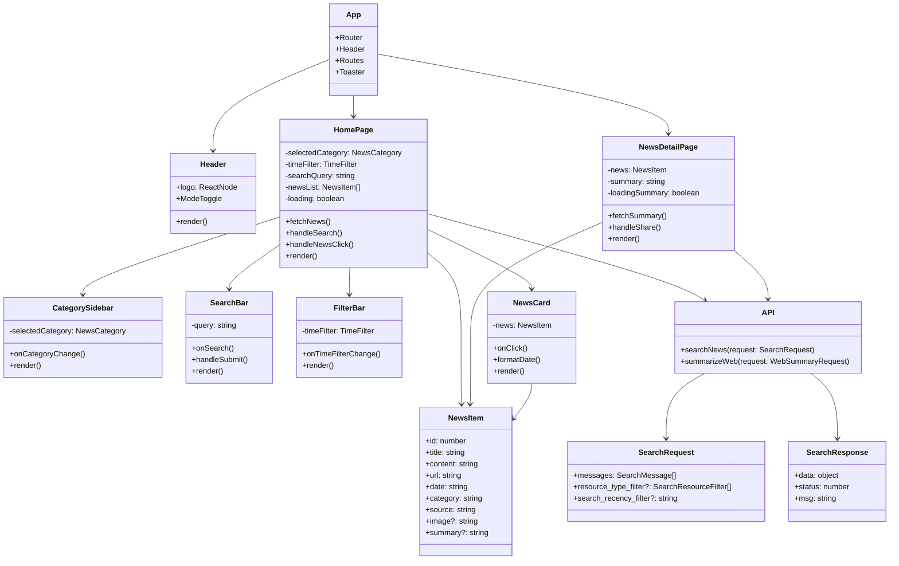
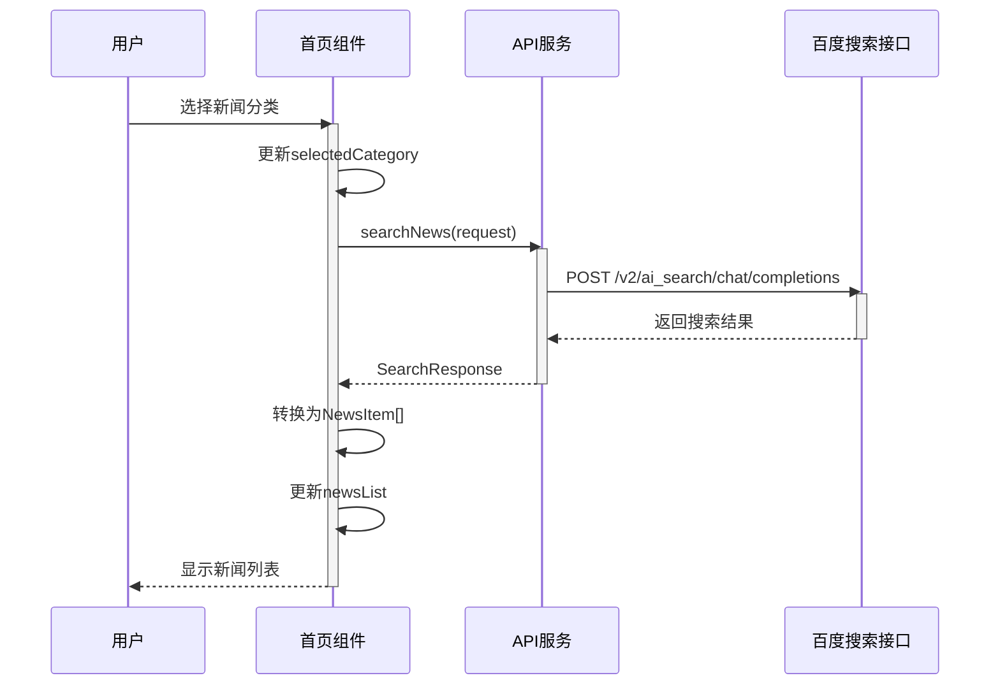
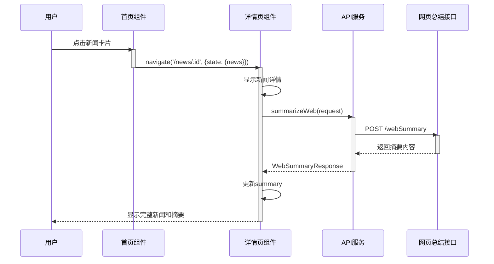
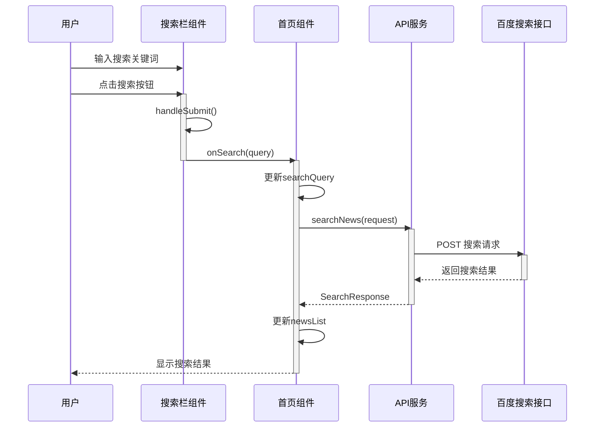
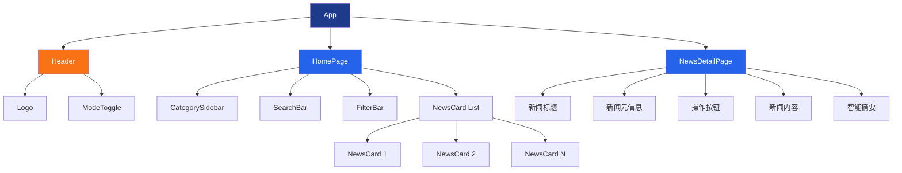
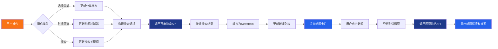
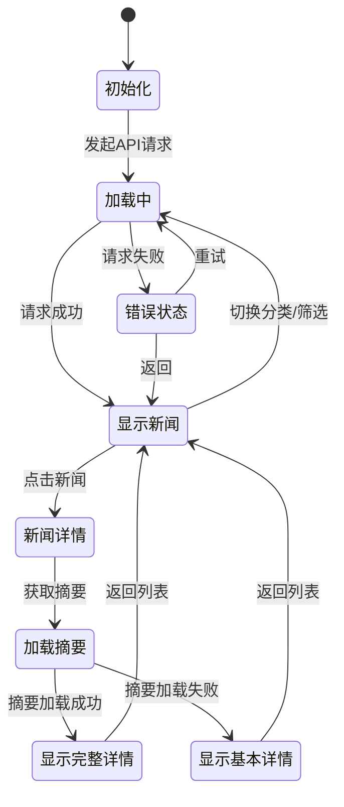
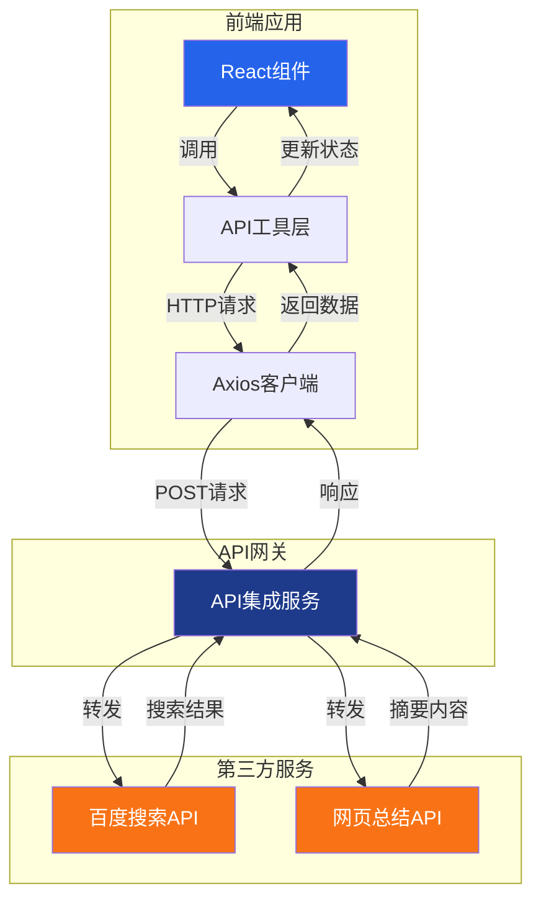

# 热点资讯汇 - UML 设计图

## 1. 系统架构类图

## 2. 新闻获取流程时序图

## 3. 新闻详情查看流程时序图

## 4. 搜索功能流程时序图

## 5. 组件层次结构图

## 6. 数据流图

## 7. 状态管理图

## 8. API交互架构图

## 说明

### 主要组件职责

1. **App**: 应用根组件，管理路由和全局布局
2. **Header**: 顶部导航栏，包含Logo和主题切换
3. **HomePage**: 首页，展示新闻列表和筛选功能
4. **NewsDetailPage**: 新闻详情页，展示完整新闻内容和智能摘要
5. **CategorySidebar**: 分类侧边栏，用于切换新闻分类
6. **SearchBar**: 搜索栏，支持关键词搜索
7. **FilterBar**: 筛选栏，支持时间范围筛选
8. **NewsCard**: 新闻卡片，展示单条新闻摘要

### 数据流向

1. 用户操作 → 组件状态更新 → API请求 → 数据处理 → UI更新
2. 所有API请求通过统一的API工具层处理
3. 使用React状态管理组件内部状态
4. 通过React Router进行页面导航和状态传递

### API集成

1. **百度搜索接口**: 用于获取热点新闻列表
2. **网页总结接口**: 用于生成新闻内容的智能摘要
